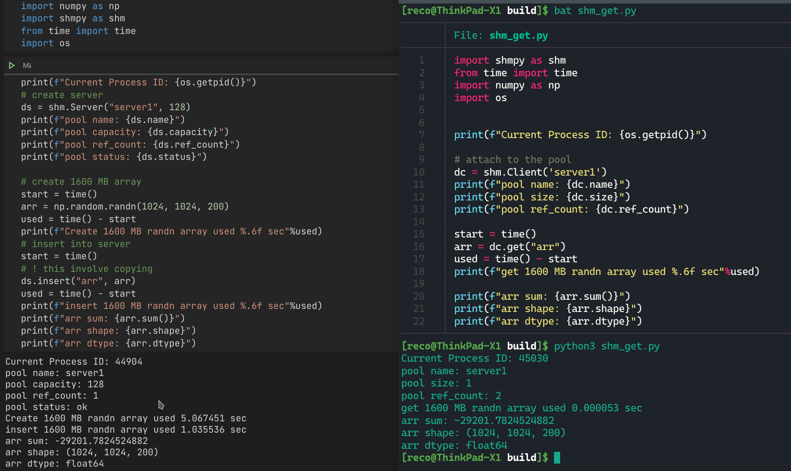

# shmpy - Share data between process via IPC(SystemV)

**warning**  
This is just an early version. Only test on Linux 5.4 x86_64 Python3.8. Win32 version will be provided later.


## Core feature
1. share data via IPC(Shared Memory)
2. Specific dtypes e.g. *primitives* *pylist*, *pydict*, *pystr*, *pytuple* and *py buffer protocol* can shared between difference language.
3. fast

## Build
I am using vcpkg to manage the third-party library. I recommand you to use it as well.
1. Pre-requirement:
    install *pybind11* *gtest* and *spdlog*
2. clone this project
3. exec following cmd
```
cd shmpy
mkdir build
cd build
cmake .. -DCMAKE_TOOLCHAIN_FILE="<Your vcpkg root>/scripts/buildsystems/vcpkg.cmake"
make
```
after that, you should see a shared lib with similar name as `shmpy.cpython-38-x86_64-linux-gnu.so` (name might be different, depend on with version python lib you are linking). and `shmpy_test` this is the testcase, however, I only wrote the testcase for Pool.

## Usage


when you call `del ds` the server will be first to send a msg to all the attaching clients via message queue, ask them to detach and then the server
detach itself from the shared memory and finally destory the shared memory. The message queue will be destoryed as well.